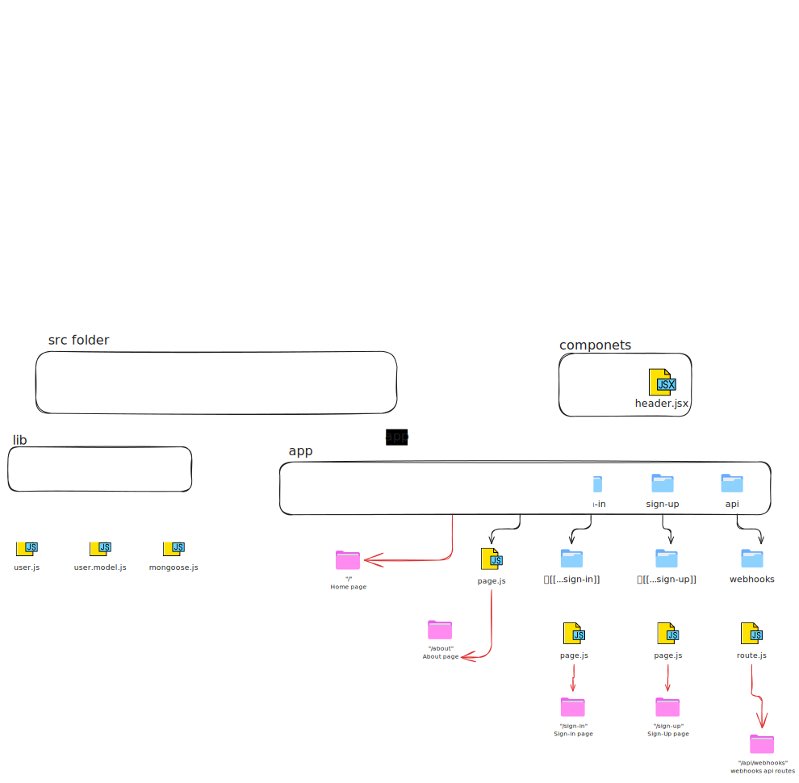

# Next.js Authentication with MongoDB, Mongoose, and Clerk:

This is a Next.js project that demonstrates how to implement authentication using Clerk and MongoDB with Mongoose for user management. This project will help you set up authentication in your Next.js app while managing user data in MongoDB.


### Project Strucure:
<p><a target="_blank" href="public/Next-Auth.excalidraw.svg" style="display: inline-block;"></a></p>

### Features
User Authentication via Clerk
Implement secure user authentication using Clerk, which provides easy-to-use authentication tools.

MongoDB Integration using Mongoose
Integrate MongoDB into your Next.js app with Mongoose to manage user data and other application-related information.

Store User Data in MongoDB
Use Mongoose models to store and manage user data securely in your MongoDB database.

Secure Authentication System
Ensure that all authentication and user data are handled securely using the Clerk API, while MongoDB provides a reliable backend database for storing user information.


Sure! Here's a full README for a Next.js authentication project using MongoDB, Mongoose, and Clerk.

Next.js Authentication with MongoDB, Mongoose, and Clerk
This is a Next.js project that demonstrates how to implement authentication using Clerk and MongoDB with Mongoose for user management. This project will help you set up authentication in your Next.js app while managing user data in MongoDB.


### Prerequisites
1.Before getting started, make sure you have the following:

2.Node.js installed (preferably version 16 or later)
MongoDB account and a cluster created
Clerk account for authentication
Vercel account for deployment (optional)


## Setup and Installation

### 1. Clone the Repository

Clone the project repository to your local machine:

```bash
git clone https://github.com/yourusername/nextjs-authentication.git
cd nextjs-authentication

```
### 2. Install Dependencies

```bash
npm install
```
### 3. Set up Environment Variables

```bash
NEXT_PUBLIC_CLERK_FRONTEND_API=<your-clerk-frontend-api>
CLERK_API_KEY=<your-clerk-api-key>
MONGODB_URI=<your-mongodb-connection-string>
```
Replace the placeholders:
- `<your-clerk-frontend-api>`: Your Clerk frontend API key from the Clerk dashboard.
- `<your-clerk-api-key>`: Your Clerk API key.
- `<your-mongodb-connection-string>`: Your MongoDB connection string (you can get it from MongoDB Atlas or your local setup).

### 4. Configure Clerk and MongoDB
1. **Follow the Clerk documentation**:
   - For setting up authentication in your application, refer to the [Clerk Docs](https://clerk.dev/docs).
   
2. **Ensure MongoDB is set up and accessible**:
   - You can use [MongoDB Atlas](https://www.mongodb.com/cloud/atlas) for a cloud-based database setup.
   - Alternatively, if you prefer a local setup, make sure your MongoDB instance is running and properly configured.

### 5. Set Up Clerk Authentication

Clerk will handle authentication for us. Ensure the Clerk frontend and API keys are correctly set up. Clerk offers both OAuth and JWT authentication, which can be used based on the project's needs.

You can integrate Clerk into your Next.js app by importing Clerk's provider into `pages/_app.js`:

```js
import { ClerkProvider, RedirectToSignIn } from '@clerk/clerk-react';
import { BrowserRouter } from 'react-router-dom';

const MyApp = ({ Component, pageProps }) => {
  return (
    <ClerkProvider frontendApi={process.env.CLERK_FRONTEND_API}>
      <Component {...pageProps} />
    </ClerkProvider>
  );
};

export default MyApp;

```

### 6. Set Up NextAuth (Optional)

If you prefer to use NextAuth instead of Clerk, you can install and configure NextAuth by replacing the Clerk authentication setup with the following steps:

1. **Install NextAuth and its MongoDB adapter:**

    ```bash
    npm install next-auth @next-auth/mongodb-adapter
    ```
2. **Set up NextAuth in `pages/api/auth/[...nextauth].js`**


    ```js
    import NextAuth from "next-auth";
    import Providers from "next-auth/providers";
    import { MongoDBAdapter } from "@next-auth/mongodb-adapter";
    import clientPromise from "../../../lib/mongodb";

    export default NextAuth({
    providers: [
        Providers.Google({
        clientId: process.env.GOOGLE_CLIENT_ID,
        clientSecret: process.env.GOOGLE_CLIENT_SECRET,
        }),
        Providers.Credentials({
        // Add your credentials provider logic here
        }),
    ],
    adapter: MongoDBAdapter(clientPromise),
    session: {
        jwt: true,
    },
    pages: {
        signIn: "/auth/signin",
    },
    });
    ```

### Running the Project Locally

Once the setup is complete, you can start the local development server with the following command:

```bash
npm run dev
```

### Deploying to Vercel

Once you're ready to deploy, you can deploy your app to Vercel by following these steps:

1. Push your project to a GitHub repository.
2. Go to the [Vercel dashboard](https://vercel.com) and log in with your account.
3. Click **"New Project"** and select the repository you just pushed.
4. Vercel will automatically deploy your Next.js project.
5. Set your environment variables (`MONGODB_URI`, `CLERK_FRONTEND_API`, `CLERK_API_KEY`) in the Vercel dashboard under **"Environment Variables"** for the project.

### Authentication Flow

1. When a user visits the app, they are presented with either a **sign-up** or **sign-in** form (depending on the URL route).
2. The user enters their credentials, which are processed by Clerk or NextAuth.
3. Once authenticated, the user is redirected to the homepage or another protected route.
4. User data is stored in MongoDB via Mongoose for later use (e.g., to display on user profile pages).

### Contributing

If you have any suggestions, fixes, or improvements, feel free to **fork this repository** and submit a **pull request**.

## License

This project is licensed under the MIT License - see the [LICENSE](./LICENSE) file for details.

### Resources

- [Clerk Documentation](https://clerk.dev/docs)
- [MongoDB Documentation](https://www.mongodb.com/docs)
- [Next.js Documentation](https://nextjs.org/docs)
